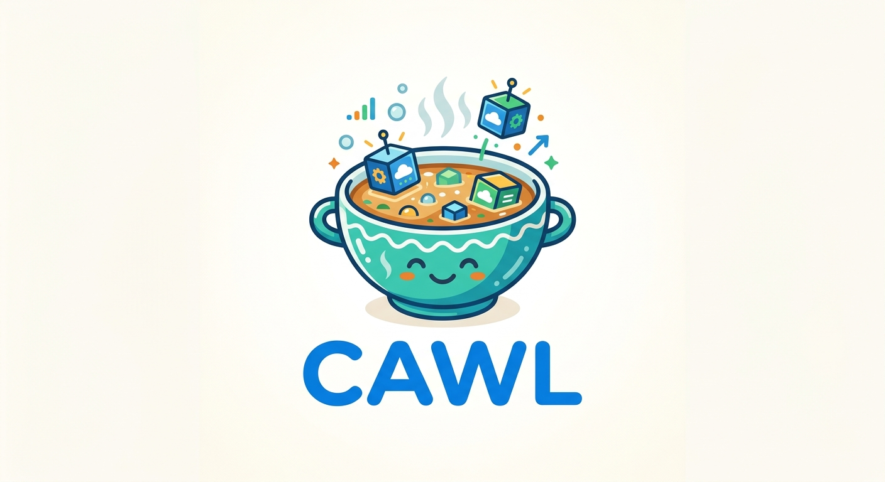

<p align="center">
  
</p>

# cawl

> **cawl** /kaʊl/ *noun*  
> A traditional Welsh soup or stew.

cawl is a tool for creating ephemeral environments for teams working on software.

It's designed to make it easy for developers to:

- Bring up a disposable environment for their work (or for an agent to work inside)
- Share that environment with team members for review or collaboration
- Expose a shareable URL for the environment for acceptance testing or demonstration

It's got two bits:

- A server, that manages all these VMs, authentication, lifecycle and generally keeps things working
- A CLI, that provides the user interface and command-line access to the server

You own the infrastructure. Right now that's an Incus host that you manage. Might be more options in the future.

> **Is this project slop?**
>
> This project was built with substantial LLM assistance. Its design and
> implementation were guided by a human and I believe it succeeds at what it
> sets out to do.
>
> As with any project, please do your own due diligence: review the code
> yourself, or ask an LLM of your choice to help review it.
>
> If it's slop, it was probably going to be slop if I wrote it by hand too.

## Quick start

Sorry, there's no quick start, it takes a bit of work to get going. You need three things to work with cawl:

- A server running Incus where all the VMs run
- A server running the cawl daemon and database (PostgreSQL) - this can be the same server as the Incus host
- A client running the cawl CLI

Take a look at [Setting It Up](docs/setup.md) to get started.

When the server is in place, install the CLI and login:

```bash
uv pip install -e ./cli
cawl login
```

Then you do something like:

```bash
cawl template ls                          # what apps are available
cawl up acme-cms --name my-test           # bring one up
cawl ssh my-test
cawl exec my-test -- python manage.py test
cawl expose my-test 8000
cawl rm my-test
```

## Docs

The full documentation is in [`docs/`](docs/):

- [What cawl is](docs/index.md) - an overview of cawl and its design
- [Usage](docs/usage.md), day-to-day usage patterns
- [Templates](docs/templates.md), teaching cawl about stuff you want to run
- [CLI](docs/cli.md), every command and option

For whoever runs the server:

- [Setting It Up](docs/setup.md), the daemon, Incus, DNS, and SSH access
- [Extending](docs/extending.md), custom access providers and backends
- [Design](docs/design.md), why it's built the way it is

Deploy specifics (certificates, systemd units) are in
[`server/deploy/README.md`](server/deploy/README.md).
